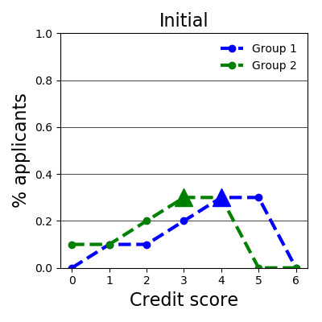
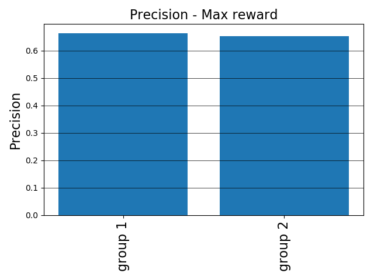
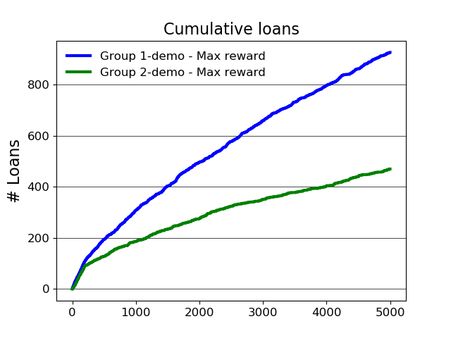
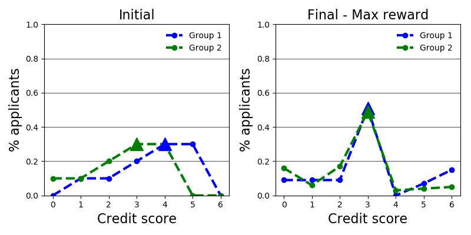
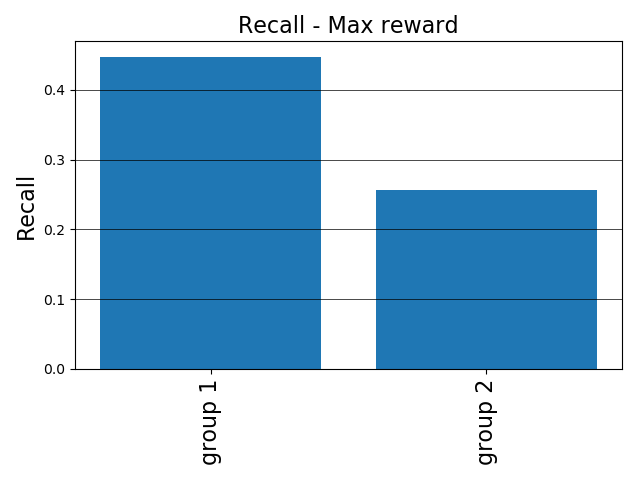

# Quick start guide

Before you start, make sure you have followed the

[installation instructions](installation.md).

## Running a simulation

We will start with an example using the
[lending environment](../environments/README.md).

This environment plays out a simple simulation. There are 7 possible credit
scores. If you have score i, there is a probability p(i) that you will pay back
your loan. The higher your score, the higher your likelihood of repaying your
loan. If you repay, your score (and your associated probability of success) goes
up. Otherwise, it goes down.

There are two groups of applicants, group 1 and group 2.

At the beginning of the simulation, group 2 is disadvantaged - their
distribution over credit scores is lower.

<p align="center">
  
  <br>
  Histogram of credit score distributions at the start of the simulation.<br>
  Triangle markers indicate the median credit score for each group.
</p>

The classifier is trying to find one or more appropriate threshold(s) for giving
out loans. It will follow a simple rule. For the first 200 steps, it will give
out loans to everyone. After that, it will use that data to find the threshold
with the highest accuracy. (In this simulation, the cost of a false positive is
exactly equal to the gain from a true positive, so accuracy is a reasonable
metric to optimize).

Run the following command to run a simulation:

```bash
python experiments/lending_demo.py --num_steps=5000
```

Congratulations, you've run your first ML-fairness-gym simulation!

## Interpreting the generated results

There are a lot of angles to examine this simulation from. Let's look at the
plots that are generated.

### Profit

In stdout, you'll see the profit rate (total profit / number of steps) of the
bank. On average, how much money it made per step. This is hard to interpret in
isolation, but we can compare different strategies to see how they compare.

```console
Profit Max reward 0.110022
```

### Precision

<p align="center">
  
</p>

Next, let's look at precision, of all the people who received loans, how many of
them paid back. This metric is stratified between groups, and precision is very
similar for both groups. Is this surprising?

Precision is easy for the agent to calculate for itself because it doesn’t
require any access to ground-truth that the agent doesn’t have - but it doesn’t
tell the whole story.

### Cumulative loans

<p align="center">
  
</p>

The cumulative loans plot shows that group 1 is getting more loans than group 2.
This is probably not surprising since group 1 had more high credit scorers at
the start of the simulation.

### Final distribution

<p align="center">
  
</p>

Final distribution of credit scores is another metric to look at. After the
simulation has been run for 5000 steps, which group is advantaged?

This process has brought the distribution of credit scores closer together.

### Recall

<p align="center">
  
</p>

This metric is counterfactual because it requires reasoning about whether
someone who was rejected for a loan _would have paid it back_.

Members of group 2 who would have paid back, are less likely to receive loans.

## Changing the lending strategy

Now let’s try a different lending strategy in this same scenario.

Instead of attempting to maximize reward, the agent will try to maximize its
reward subject to equality of opportunity constraints.

A word of caution: Equality of opportunity constraints require measuring recall,
which we mentioned above is not possible (at least not directly) for an agent
that does not have access to counterfactual data. As such we will be using
equality of opportunity - as measured on all of the _labeled data_ that the
agent has. This approximation may not always exactly work - as you will see in
the next simulation.

Try running the next command in a different console window so that you can
compare the generated plots.

```console
python experiments/lending_demo.py --equalize_opportunity --num_steps=5000
```

A number of things have now changed.

### Cumulative loans

The cumulative loans plot shows that group 2 started out same number of loans,
but ends up “ahead” after about 2000 steps. If this plot continued for another
5000 steps, what do you think you would happen? Change the --num_steps argument
of the simulation to find out.

### Final distribution

This process has lowered the credit scores of group 2 more than group 1. Is this
a good thing or a bad thing? It certainly highlights that applying a policy for
a long time unintended consequences.

### Recall

The recall plots show an increase in recall for group 2 - but is equality of
opportunity really being achieved?

Now group 1 has lower recall. This agent is applying thresholds that were
largely learned to create equality of opportunity in the initial distribution,
but a lot has changed since then. Can you design an agent that will maintain
equality of opportunity throughout a long simulation?

### Profit

```console
Profit Eq. opportunity 0.132426
```

This is truly surprising. The equality of opportunity threshold scheme is
actually more profitable than the profit-maximizing scheme!

The profit maximizer is myopic. It only looks one step ahead and doesn’t account
for dynamics. Candidates with credit score = 3 have a 45% chance of repaying
their loan. A greedy agent may not lend to them, but a more forward looking
agent would recognize that beyond the immediate outcome of the loan, there is
also an expected shift in credit score, which has long term value as well.

The equality of opportunity agent happened to learn a rule that was better in
the long term. Will this always happen? Under what conditions does it happen? Is
there an even more profitable policy out there?

## Next steps

There are lots of questions to explore in this environment. Take a look at
experiments/lending.py to see the experiment class. Try different parameters -
or design an entirely new agent.
