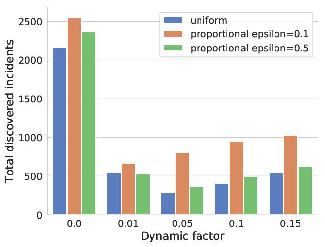
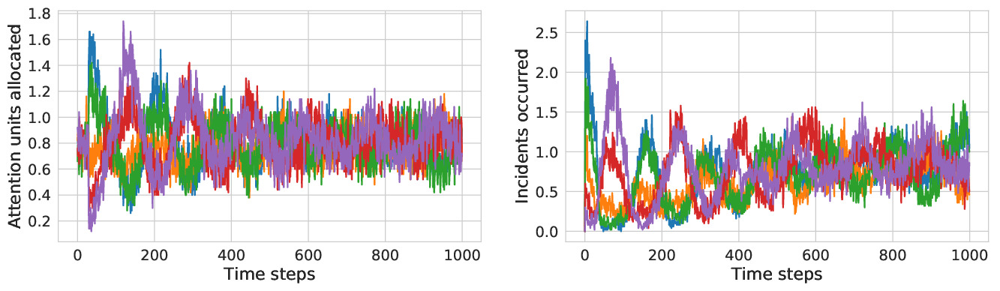
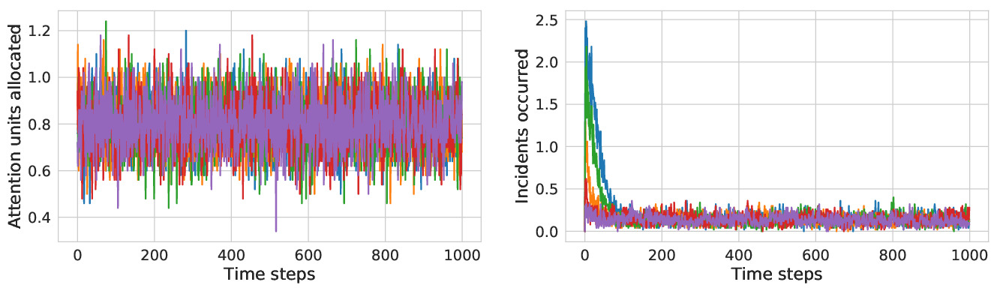

# Attention Allocation

## Background

### Environment

This environment simulates an attention allocation problem, where an agent is
tasked with spot checking or monitoring several sites for incidents, but does
not have sufficient resources to do so exhaustively at each time step. Examples
of this problem arise in food inspection, child services, and pest control.
Previous work has also framed predictive policing in this way, but we explicitly
refrain from doing so, in part because of concerns raised in [3].

Attention allocation has a clear fairness dimension that has been explored in a
number of papers. These papers have proposed notions of fair allocation, and
examine how naive policies can fail to achieve these notions of fairness because
of the skewed observation mechanism that results from only observing incidents
at sites where attention has been allocated previously [1, 2]. The fairness
notions proposed include proportional allocation [1] and allocation schemes that
achieve approximate equality of candidate discovery, based on the principles of
equality of opportunity [2].

The attention allocation environment implements a scenario where, at each step,
an agent allocates N units of attention across K sites. The environment
generates a set of incidents at each site, but the agent's observations of
incidents are limited by their allocation of attention. Each unit of attention
can discover at most 1 incident. The agent then observes the number of
discovered incidents at each location. Based on this feedback, the agent makes a
decision about how to allocate attention at the next time period. In addition to
the standard attention allocation setting considered in [1] and [2] where
incident rate at each site are fixed over time, this environment implements some
dynamics where the incident rate changes based on the amount of attention that
was allocated to that site in the last time period. We pick the following
dynamics to explore, however other, more complex, feedback relationships between
attention allocation and incident relationships are possibly more applicable to
certain domains. The dynamics implemented in this environment are as follows: if
no attention units are allocated to a location, its incident rate increases by a
parameterized dynamic_rate, if units are allocated, the incident rate increases
by the dynamic_rate * number of units allocated.

### Agent

**Proportional Agent**: The proportional agent described in the paper is an
instantiation of the probability_matching_agents.MLEProbabilityMatchingAgent.

This agent uses MLE to estimate the underlying incident rate of each location,
$$\hat{r}_k$$, with a censored Poisson function as the likelihood function. At
each timestep, the agent allocated units by drawing from a Multinomial(N, $$p$$)
distribution where $$p = (p_1, ..., p_k)$$ is a vector of allocation
probabilities for each location. With probability $$\epsilon$$, it sets $$p_k$$
to be uniformly $$1/k$$ for all $$k$$, and with probability it sets $$p_k$$ to
be proportional to $$\hat{r}_k$$.

**Uniform Agent**: The uniform agent described in the paper is an instantiation
of the test_util.DummyAgent.

This agent samples randomly from the action space. Since the action space for
the attention allocation environment is a Multinomial space, it acts by drawing
from a Multinomial(N, $$p$$) where $$p$$ is a vector with values $$1/k$$ and
length $$k$$.

### Metrics

The metrics used to evaluate the agents in these experiments are:

*   **Total discovered incidents**: Total number of discovered incidents across
    all locations and all steps.

*   **Total missed incidents**: Total number of missed incidents across all
    locations and all steps.

## Experiments

The analysis of [2] leaves adding a feedback relationship between the allocation
scheme and incident rates to future work. The attention allocation
LocationAllocationEnv incorporates that feedback relationship between the
allocation scheme and incident rates, and parameterizes the magnitude of the
effect of the allocation with the dynamic_rate factor. We begin to explore the
effect of this feedback relationship by examining the performance of the agents
across several values of dynamic_rate factors. We evaluate using the total
discovered incidents and total missed incidents, to see examine how metric
choice can be misleading in the presence of dynamics. We report the averaged
results of 50 runs of the experiment, and let the experiments run for 1000
steps. These experiments are from "Fairness is not static" [4].

### Running the experiments

To run the experiments performed in “Fairness is not static” [4], simply run the
command:

`python examples/attention_allocation_experiment_main.py
--output_dir=[YOUR_OUTPUT_DIRECTORY]`

This will write out json result files to the specified directory, along with
pdfs of 4 plots.

If you would like to run a custom experiment, modify the
attention_allocation_experiment_main.py file's `main()` function. Create a
attention_allocation_experiment. Experiment object with your desired parameters
for the experiment, then call `attention_allocation_experiment.run(experiment)`.

### Understanding the plots

**Total discovered incidents across dynamic rates**

  

This graph displays the number of discovered incidents for each of three agents
when there are 5 different dynamic_rate parameter values. The three agents are
the uniform agent, the proportional agent with epsilon=0.1, and the proportional
agent with epsilon=0.5. From looking at this graph, it may seem that the
proportional agent epsilon=0.1 is the preferable agent, as it discovered the
most incidents at all the different dynamic_rates.

**Total missed incidents across dynamic rates**

  

This graph displays the number of incidents missed by each of the three agents
for different dynamic_rate parameter values. From this graph, we can see that
even though the proportional agent epsilon=0.1 discoveres the most incidents, it
also misses the most incidents at dynamic_rate values of 0.01 or higher. So
while it may have initial seemed like the preferable agent from only looking at
the obvious metric of number of discovered incidents, it may actually be the
worst performing when the feedback dynamics are present. We can get a greater
understanding of why this may be happening by looking at the last two charts.

**Units allocated over time and incidents occured over time for proportional
agent epsilon=0.1**

  

**Units allocated over time and incidents occured over time for uniform agent**

  

Both charts are from an environment run with the dynamic rate set to 0.1. The
left shows units allocated at each timestep, while the right shows incidents
occurred at each time step. The proportional agent (show for proportional agent
with epsilon=0.1), by unevenly allocating resources, allows the incident rates
to slowly creep up, leading to more incidents occuring overall - thus more
incidents are discovered and missed. The uniform agent, on the other hand drives
the incident rates down by allocating uniformly at random, resulting in fewer
incidents occurred.

This experiment reveals the need for more thoughtful choice of metrics. While
one might think the goal would be to maximize incidents caught, incorporating
feedback dynamics into the environment means that agents need to be evaluated
also on incidents missed. Also, while without dynamics the proportional agent
seems to be the most successful, with dynamics it may not be.

## References

[1] Danielle Ensign, Sorelle A Friedler, Scott Neville, Carlos Scheidegger, and
SureshVenkatasubramanian. 2018. Runaway Feedback Loops in Predictive Policing.
In Conference on Fairness, Accountability and Transparency. ACM, 160–171.

[2] Hadi Elzayn, Shahin Jabbari, Christopher Jung, Michael Kearns, Seth Neel,
Aaron Roth, and Zachary Schutzman. 2019. Fair algorithms for learning in
allocation problems. In Proceedings of the Conference on Fairness,
Accountability, and Transparency. ACM, 170–179.

[3] Rashida Richardson, Jason Schultz, and Kate Crawford. 2019. Dirty Data, Bad
Predictions: How Civil Rights Violations Impact Police Data, Predictive Policing
Systems, and Justice. New York University Law Review Online, Forthcoming(2019).

[4] Alexander D’Amour, Yoni Halpern, Hansa Srinivasan, Pallavi Baljekar, James
Atwood, D. Sculley. Fairness is not Static: Deeper understanding of long term
fairness via agents and environments. KDD workshop on Explainable AI (XAI) 2019.
