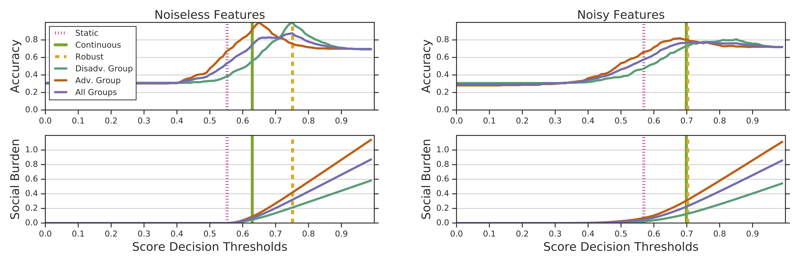

# College Admissions (Strategic Classification)

## Background

This college admissions environment simulates a binary decision setting where
individuals being classified have knowledge of the decision rule and an ability
to pay a cost to manipulate their features to obtain a better classification
result. This is known as a strategic classification setting [1]. Here, the agent
plays the role of a stylized college admissions office, where the number of
admitted candidates is not constrained.

Strategic classification scenarios have appeared in the fairness literature,
where [2] and [3] have noted that agents’ decisions to anticipate manipulation
and robustify their decision rules can have unintended impacts, especially when
different groups face different costs of manipulation.

## Details

### Environment

At each time step, the environment generates a batch of candidates with
accompanying test scores. The candidates are then able to pay a cost to
manipulate their scores upward so that they will be admitted according to the
published rule, but will only do so if the utility of exceeding the threshold is
greater than the cost they pay.

This environment provides various settings to understand effects of subsidies,
noisy thresholds observed by applicants, noisy observations observed by the
agent and different group-wise feature distributions and cost functions.

### Agent

The agent observes manipulated test scores and updates its decision rule. All
agents can be run in an epsilon greedy mode, wherein, a candidate is allowed
with a probability p, and allowed only if score is above a threshold with a
probability 1-p. Its action includes a published threshold as well as an epsilon
probability, which by default is 0 in case of a non-epsilon greedy agent. The
agent also allows one to set an initial threshold and a burnin period, where the
published threshold is the initial threshold during the burnin period. If this
initial threshold is set to 0, the agent can essentially get unmanipulated
features.

For the experiments the agents implemented are :

1.  **Fixed Agent**: This agent always publishes a fixed threshold.

2.  **Naive Agent**: This agent assumes no manipulation. It uses a burnin
    period, where it publishes a fixed threshold, after the burnin period, it
    learns a threshold and fixes it for the next timesteps.

3.  **Continuous Agent**: This agent is similar to the Naive agent in that it
    does not assume startegic behaviour. However, at each time-step it changes
    it threshold until equilibrium is reached.

4.  **Robust Agent**: This agent uses the robust strategy mentioned in [1].
    Wherein, for a burnin period, the threshold is 0, and it sees unmanipulated
    scores. After that, it picks a threshold by assuming maximum manipulation
    (it has access to cost functions).

### Metrics

For this set of experiments we report the following:

*   **Group-wise Accuracy**: Accuracy for each group

*   **Group-wise Social burden**: Social burden as described in [3], is the
    average cost paid by each group over all rounds for all candidates that were
    eligible.

*   **Final threshold at equilibrium**.: This is the final threshold reached at
    equilibrium.

## Experiments

Analysis in [2] and [3] has considered a one-shot setting where an agent that is
aware of score gaming reasons strategically and sets its threshold more
conservatively in anticipation of manipulation. This robust agent stands in
contrast to a naïve agent that sets its decision policy assuming that scores
will remain unmanipulated. In addition, Hu et al. [2] and Milli et al. [3] study
this game under the assumption that scores perfectly predict outcomes, and, even
in this simple scenario, show that robust strategies can impose substantial
burdens on qualified applicants.

Using our simulation framework, we extend the analysis of this setting in two
ways. First, we compare the behavior of the one-shot agents treated in previous
work with the behavior of an agent that is able to retrain its classifier across
many rounds of decisions,but remains unaware of gaming behavior. Second, we
consider how noise in the relationship between an applicant’s unmaipulated score
and their true label affects the behavior of each agent.

We find that with and without noise, the continuously retrained agent
compensates for some gaming behavior. This suggests that the fairness
implications of robust policies need to be considered in continuous retraining
contexts, even if the agent is not designed to anticipate strategic manipulation

### Running the experiments

#### Reproducing experiments from KDD paper.

To run the experiments for the college admissions scenario to recreate the plots
from the KDD 2019 paper [4] run the following command:

`python examples/college_admissions_main --num_steps=750 --burnin=10
--epsilon_greedy=False --verbose=True --noisy_dist='gaussian'
--noisy_features=False --noisy_threshold=False --feature_mu='0.5','0.5'
--output_dir="path/to/output_dir/kdd"`

The arguments are as follows:

`num_steps`: Int. Number of steps to run the episode.

`burnin`: Int. Number of steps to allow for burnin period.

`epsilon_greedy`: Bool. Whether to use an epsilon greedy agent.

`verbose`: Bool. Whether to use verbose logs.

`noisy_dist`: Enum. The noise distribution to use.

`noisy_features`: Bool. Whether to use noisy features.

`noisy_threshold`: Bool. Whether to use noisy threshold.

`feature_mu`: List. The means for each group feature distribution.

`output_dir`: String. The path name to output dir where results will be written.

  

Running this command should generate the plots (with the name
threshold_pair0.pdf in the output_dir) as shown in Figure. It generates two
panels, one for the noiseless case and one for the noisy case. Each of these
panels has plots for group-wise and overall accuracy and social burden plotted
against thresholds for different agents. The plots shows the thresholds for a
fixed agent and the accuracy and social burden for each threshold and the
vertical lines represent the equilibrium thresholds reached by each of the
Naive, Continuous and Robust agents.

#### Unequal Group Distributions.

To run experiments with an unequal distribution one can change the feature_mu
flag and provide different means for each group. For ex., the folowing command
will run the same experiment with group 0 mean as 0.6 and group 1 mean as 0.4.

`python examples/college_admissions_main --num_steps=100 --burnin=50
--epsilon_greedy=False --verbose=True --noisy_dist='gaussian'
--noisy_features=False --noisy_threshold=False --feature_mu='0.6','04'
--output_dir="path/to/output_dir/unequal_distribution"`

#### Experiments with noise.

One can also run experiments for different noise distributions, by varying the
standard deviation in the case of Gaussian distribution or the beta value in the
case of Beta distribution. The noise can either be added to features or to the
observed agent's published threshold or both and can be controlled through the
-`-noisy_features` and `--noisy_thresholds` flags.

`python examples/college_admissions_main --num_steps=100 --burnin=50
--epsilon_greedy=False --verbose=True --noisy_dist='gaussian'
--noisy_features=True --noisy_threshold=False --feature_mu='0.5','0.5'
--output_dir="path/to/output_dir/noisy_expts/"`

This run generates a plot of accuracy and social burden for each value of
standard deviation or beta with the name "thresholds_\<variance/beta\>.pdf" as
well as a comparison of metrics across various agents in
"metrics_\<variance/beta\>.pdf" . In addition it also produces a plot of
differences (called deltas.pdf) in final thresholds reached by the continous and
fixed agent.

## References

[1] Moritz Hardt, Nimrod Megiddo, Christos Papadimitriou, and Mary Wootters.
2016.Strategic classification. In Proceedings of the 2016 ACM conference on
innovations in theoretical computer science. ACM, 111–122

[2] Lily Hu, Nicole Immorlica, and Jennifer Wortman Vaughan. 2019. The disparate
effects of strategic manipulation. In Proceedings of the Conference on Fairness,
Accountability, and Transparency. ACM, 259–268.

[3] Smitha Milli, John Miller, Anca D Dragan, and Moritz Hardt. 2019. The Social
Cost of Strategic Classification. In Proceedings of the Conference on Fairness,
Accountability, and Transparency. ACM, 230–239.

[4] Alexander D’Amour, Yoni Halpern, Hansa Srinivasan, Pallavi Baljekar, James Atwood, D. Sculley.  Fairness is not Static: Deeper understanding of long term fairness via agents and environments. KDD workshop on Explainable AI (XAI) 2019.

