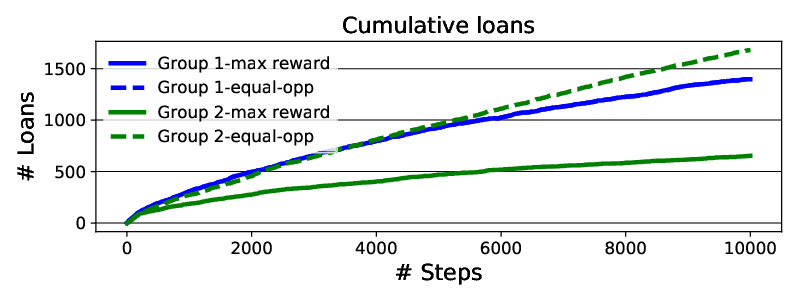
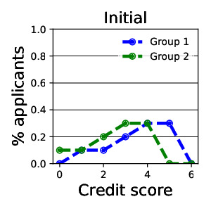
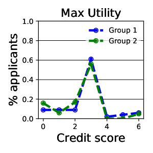
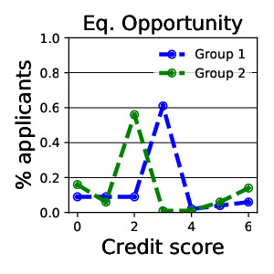

# Lending (Binary Classification)

## Background

In this set of environments, the agent plays the role of a bank that has a
certain amount of cash that it can use to extend loans to applicants. The
environment generates a stream of applicants who have a set of observable
features that are related to their probability of repaying or defaulting if they
are given a loan. If a loan is given and the applicant pays back, the bank earns
interest on the loan; otherwise, if the applicant defaults, the bank loses the
loan amount. If the bank rejects a loan, it never learns whether the applicant
would have paid back or not. The bank is allowed to make loans until it runs out
of cash.

The lending environments are designed to probe the behavior of agents that learn
standard binary classification rules over time. These have been studied
extensively in one-shot contexts the fairness literature, and a number of
fairness interventions that modify the standard empirical risk minimization
approach have been proposed to enforce some notion of fairness in this context
[1, 2]. These environments can be used to understand how these interventions
interact with dynamics, an issue that was raised in [2].

## Variants

Simple Loan: This is a “hello world” environment that incorporates no notion of
group. Applicants either have a high repayment probability or a low repayment
probability, but this class label is unobservable. Instead, applicants have
two-dimensional observable features. The optimal decision rule on the basis of
observed features is linear.

Delayed Impact: This environment implements a simple case of the credit score
dynamics proposed in [2]. Each applicant has a discrete credit score. If an
applicant is given a loan, their credit score changes in the next time period.
if they pay back the loan, their score increases by 1; if they default, their
score decreases by 1. The probability of paying back loans depends on a
candidate’s credit score.

## Agents

ClassifierAgent: Learns a linear transform of the features followed by a
threshold (Logistic regression).

ThresholdAgent: Learns a simple threshold rule.

Both agents can apply equality of opportunity constraints [1] when setting their
thresholds.

## Metrics

Available metrics to measure in these environments are:

Profit rate (bank profit / number of simulation steps). Cumulative loans
received stratified by group. Initial and final credit distributions (for the
DelayedImpact environment) - shows how each group’s credit distributions change
over the course of the simulation. Precision and Recall stratified by group.

## Interpreting the plots

Running examples/lending_experiments_main.py reproduces the plots for the KDD
workshop paper [3].

The cumulative loans given to each group are plotted over the course of the
10,000 steps of the simulation.

  

Group-1 equal opportunity and group-1 max reward are exactly equal, so only one
line shows up.

The credit score plots show histograms of the two groups’ distributions over
credit scores at the beginning of the simulation and then at the end using a
threshold agent, optimizing myopic utility, and a similar agent which
additionally applies equality of opportunity constraints.

  

By applying equality of opportunity, group 2’s credit scores are moved lower.
Whether this is a good thing or a bad thing is subject to interpretation, since
group 2 received more loans in the process.

Stratified recall values are logged: 

`Maxutil recall: {'1': 0.35, '2': 0.18}
Equality of opportunity recall: {'1': 0.35, '2': 0.50}`

Recall for group 1 is the same in both settings, while the recall for group 2
jumps from 0.18 under a maximum utility policy to 0.5 under an equality of
Opportunity policy.

Profit rate values are also logged:

`Maxutil profit rate: 0.072 Equality of opportunity profit rate: 0.11`

In this case, the bank was more profitable by using equality of opportunity,
though that is not always the case.

See the quickstart guide for an example of running an experiment with a lending
environment.

## References

[1] Moritz Hardt, Eric Price, and Nathan Srebro. 2016. Equality of opportunity
in supervised learning. In Proceedings of the 30th International Conference on
Neural Information Processing Systems.

[2] Lydia T Liu, Sarah Dean, Esther Rolf, Max Simchowitz, and Moritz Hardt.
2018. Delayed Impact of Fair Machine Learning. In Proceedings of the 35th
International Conference on Machine Learning.
